# Presentation Diagrams

All diagrams use [Mermaid](https://mermaid.js.org/). GitHub renders them inline.
To export as PNG/SVG for slides, paste into [mermaid.live](https://mermaid.live)
or run `npx @mermaid-js/mermaid-cli -i diagrams.md -o output/`.

Individual `.mmd` files are in `diagrams/` for standalone rendering.

---

## Slide 4: Replication Architecture

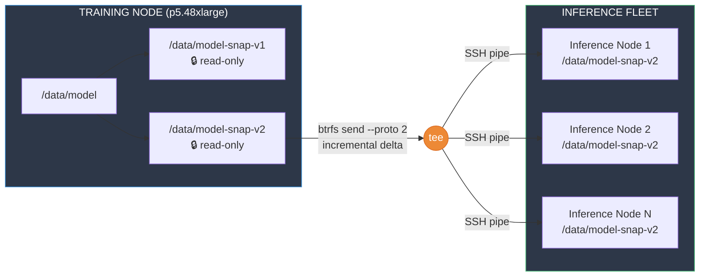

---

## Slide 6–7: Demo Flow — Full & Incremental Send

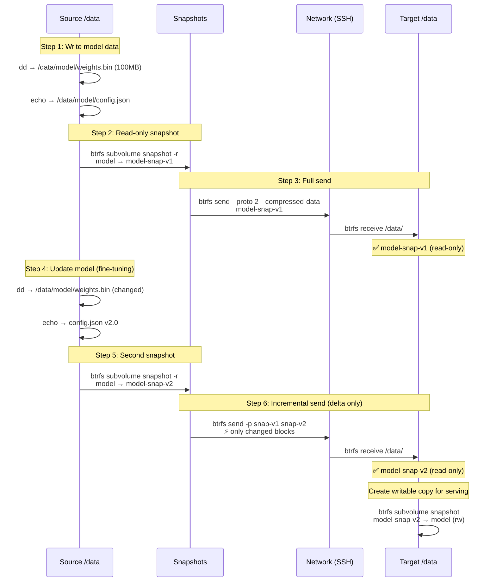

---

## Slide 9: Comparison with Alternatives

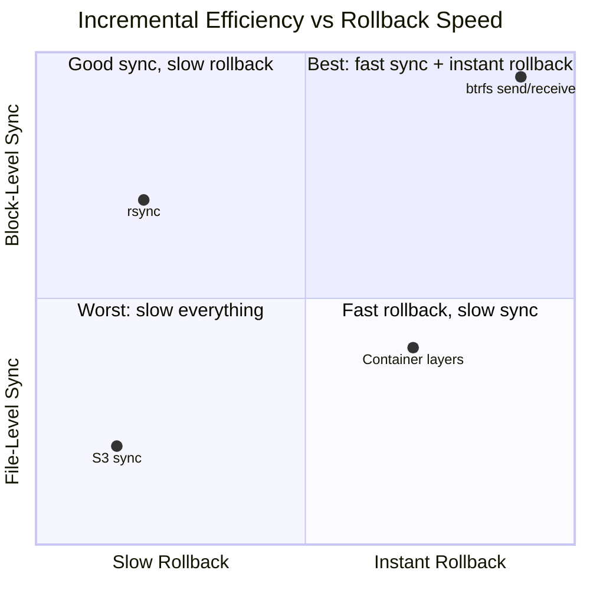

---

## Slide 11: Agent-as-User Architecture

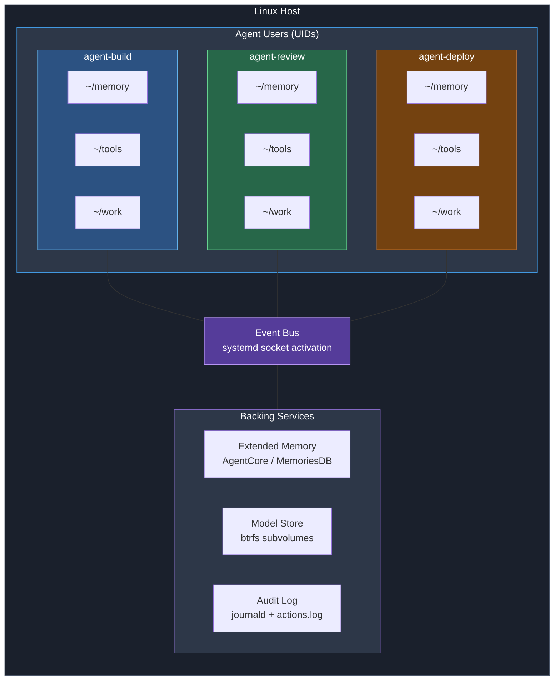

---

## Slide 12: cloud-init Provisioning Flow

```mermaid
flowchart LR
    CI["cloud-init<br/>#cloud-config"] --> U["Create system users<br/>agent-build, agent-review"]
    U --> BV["Create btrfs subvolumes<br/>/data/agents/agent-*"]
    BV --> BD["Bind-mount as<br/>home directories"]
    BD --> DIR["Create ~/memory<br/>~/tools ~/work"]
    DIR --> TMP["Mount tmpfs<br/>~/memory/working"]
    TMP --> LOG["Set append-only<br/>~/work/actions.log"]
    LOG --> SD["Enable systemd<br/>agent@.service"]
    SD --> RUN["✅ Agents running"]

    style CI fill:#ed8936,stroke:#dd6b20,color:#fff
    style RUN fill:#48bb78,stroke:#38a169,color:#fff
```

---

## Slide 13: systemd Sandboxing Layers

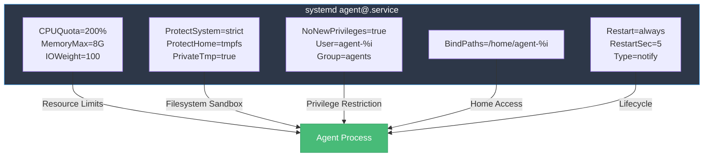

---

## Slide 14: Memory Architecture — Three Tiers

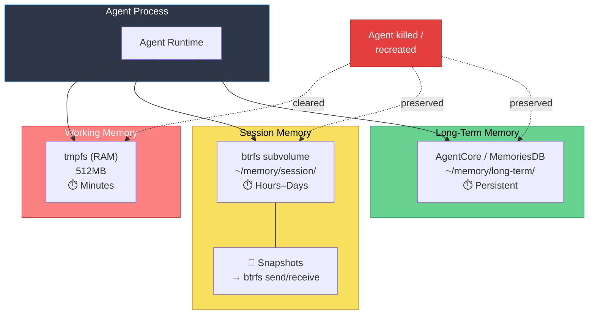

---

## Slide 15: Event-Driven Activation & microVM Decision

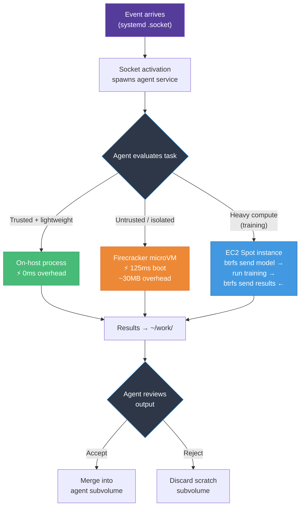

---

## Slide 16: Transparency & Audit Trail

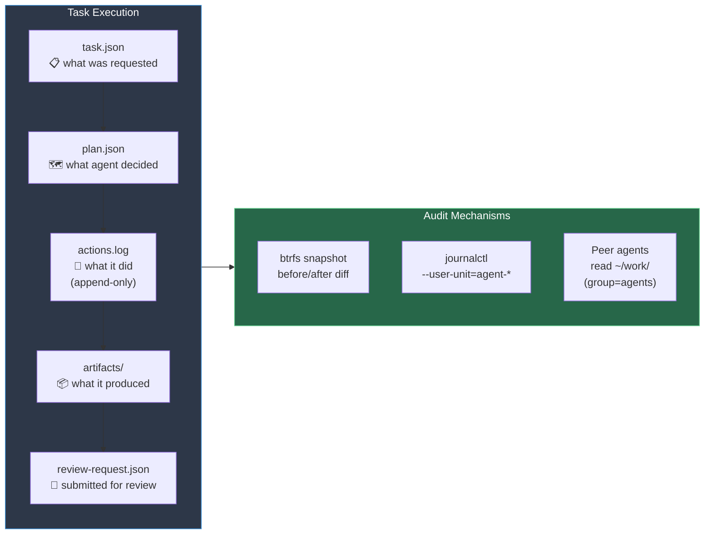

---

## Slide 17: btrfs as Universal Replication

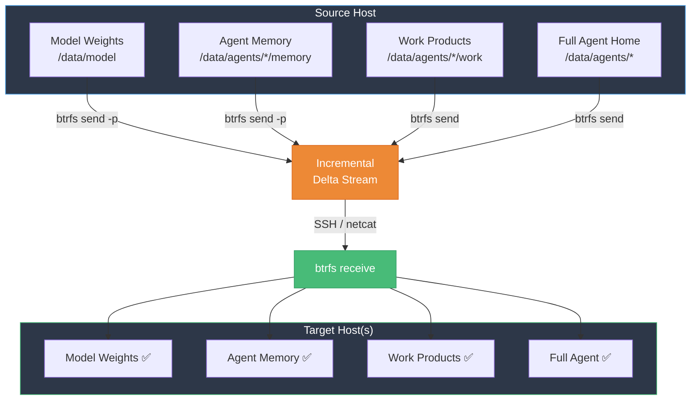

---

## Slide 18: Why Not Containers? — Visual Comparison

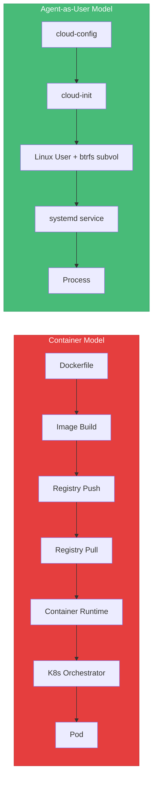

---

## Slide 19: Gaps — Where Containers Still Win

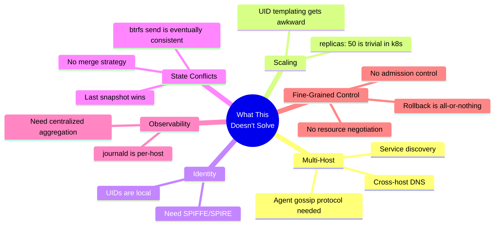
